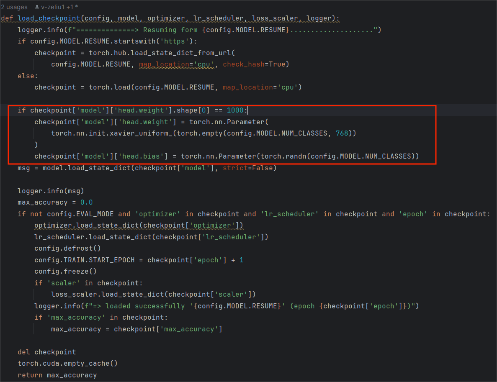
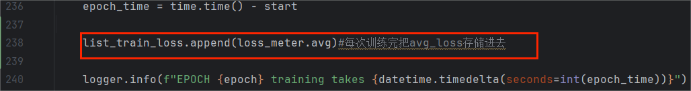
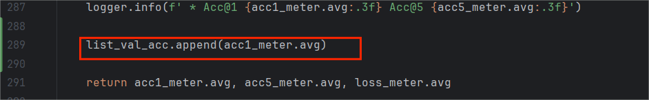
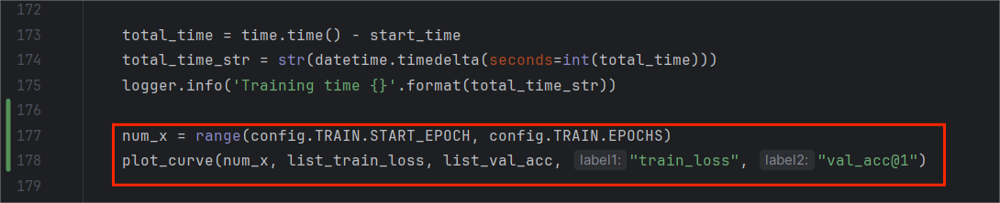
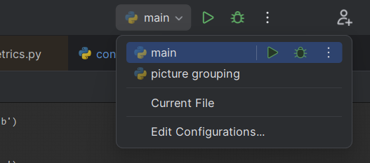
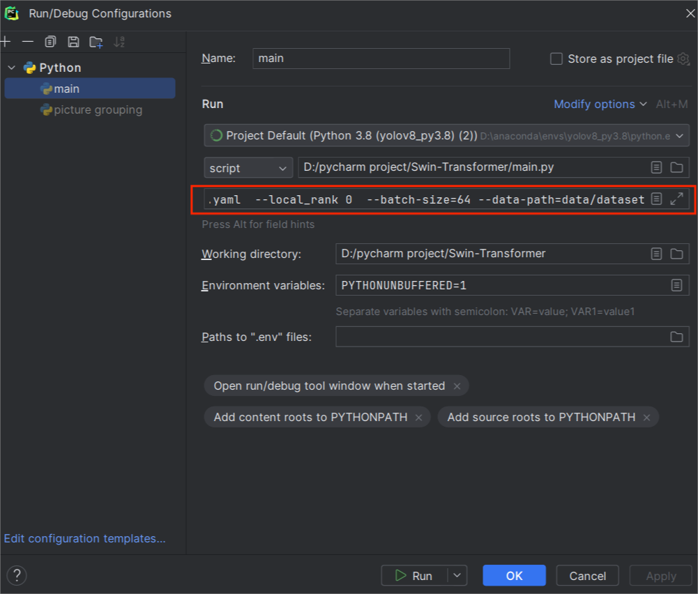
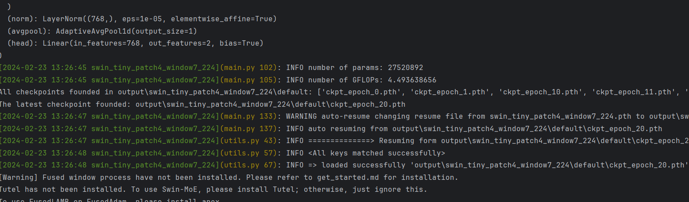

# 1.配置环境

* 本项目仅使用基础版Swin Transformer，而不是more和V2版本
* 项目环境：
  
  1. IDE:pycharm
  2. python 3.8
  3. torch==1.12.1+cu113
  4. torchaudio==0.12.1+cu113
  5. torchvision==0.13.1+cu113
  6. timm==0.3.2
  7. opencv-python==4.4.0.46
  8. termcolor==1.1.0
  9. yacs==0.1.8
* 首先要保证以下文件不存在依赖报错（导入包正确）：
  
  1. 目录data中所有文件
  2. 目录models中的：init.py、build.py、simmim.py、swin mlp.py、swin transformer.py
  3. 根目录下：config.py、logger.py、lr scheduler.py、main.py、optimizer.py、utils.py
* apex安装教程：
  
  1. APEX是英伟达开源的，完美支持PyTorch框架，用于改变数据格式来减小模型显存占用的工具。其中最有价值的是amp（Automatic Mixed Precision），将模型的大部分操作都用Float16数据类型测试，一些特别操作仍然使用Float32。并且用户仅仅通过三行代码即可完美将自己的训练代码迁移到该模型。实验证明，使用Float16作为大部分操作的数据类型，并没有降低参数，在一些实验中，反而由于可以增大Batch size，带来精度上的提升，以及训练速度上的提升。
  2. 下载：网址 [https://**github.com/NVIDIA/apex**](https://link.zhihu.com/?target=https%3A//github.com/NVIDIA/apex)，下载到本地文件夹。解压后进入到apex的目录安装依赖，再执行命令
  
  ```
  cd C:\Users\lenovo\Downloads\apex-master #进入apex目录 
  pip install -r requirements.txt
  ```
  
  3. 安装：依赖安装完后，打开cmd，cd进入到刚刚下载完的apex-master路径下，运行：
  
  ```
  python setup.py install
  ```
* **fused window process、apex等不安装也是可以跑通的。**它们的安装不影响代码的运行。如果你最后对性能有很高的要求，那你再去下载
* **若要重新开始训练，请先删除output目录中的<font color=red>swin_tiny_patch4_window7_224文件</font>**,这是我自己训练300epoch保存的权重文件

# 2.数据集

* 采用猫狗大战数据集做二分类，数据集链接：[https://**pan.baidu.com/s/1ZM8vDW**EzgscJMnBrZfvQGw](https://link.zhihu.com/?target=https%3A//pan.baidu.com/s/1ZM8vDWEzgscJMnBrZfvQGw) 提取码：48c3
* 需要在dataset目录中按如下方式设置目录：

  

* 将下载好的数据集按以下方式解压到dataset目录中：

```
|——dataset
    |——test
        |—— 0.png
        |—— 1.png
        |—— 2.png
        |——  ...
    |——train
        |——cat //这个是自己提前建好的空目录
        |——dog //这个也是提前建好的空目录
        |——cat.1.png
        |——cat.2.png
        |——cat.3.png
        |——...
        |——dog.1.png
        |——dog.2.png
        |——dog.3.png
        |——...
    |——val
        |——cat //这个是自己提前建好的空目录
        |——dog //这个也是提前建好的空目录
    |——main.py
```

这一步中需要：将数据集中的test集图片解压到test目录下，将数据集中train集图片解压到train目录下，保持val目录为空

* 在dataset目录下创建python文件：picture grouping.py,执行如下代码：

```
import os
import shutil
dir_train = '.\\train'
dir_val = '.\\val'
for file in os.listdir(dir_train):
  if file.startswith('cat') and file.endswith(".jpg"):
      num = int(file.split('.')[1])
      if num <= 9999:
          shutil.move(os.path.join(dir_train, file), os.path.join(dir_train, 'cat', file))
      else:
          shutil.move(os.path.join(dir_train, file), os.path.join(dir_val, 'cat', file))
  elif file.startswith('dog') and file.endswith(".jpg"):
      num = int(file.split('.')[1])
      if num <= 9999:
          shutil.move(os.path.join(dir_train, file), os.path.join(dir_train, 'dog', file))
      else:
          shutil.move(os.path.join(dir_train, file), os.path.join(dir_val, 'dog', file))
```

此代码的作用是：**把数据集中train目录文件下的编号是0-9999的猫和狗作为训练集(就是放到train目录下)，然后把10000-12500的猫和狗放到val文件下。**执行后，在训练集总共有20000张图片，验证集中有5000张图片。（要是觉得这个比例不够好，可以自己再去调，改上面的两个9999就可以）

* 本项目中已经将数据集按上述方式配置完毕，若需要修改数据集划分比例，则可以修改picture grouping.py中的两个**9999**

# 3.下载预训练权重

* 从modelhub.md文件中下载预训练权重。下载哪个版本都可以，**但有些模型需要配置额外的环境**。
* 本项目以Swin-T为例，下载的是Image 1K的model的预训练权重**swin\_tiny\_patch4\_window7\_224.pth**
* 将下载好的权重文件放入根目录中

# 4.修改参数

## 4.1 修改根目录下config.py：

### 4.1.1 可根据自身需要进行修改的参数

1. 训练的epoch可由以下参数自行决定：

```
_C.TRAIN.EPOCHS=300
```

2. 打印频次可由以下参数决定：

```
# Frequency to logging info 
_C.PRINT_FREQ = 10
```

3. 是否保存训练的每一epoch可由以下参数决定：

```
# Frequency to save checkpoint
 _C.SAVE_FREQ = 1
```

### 4.1.2 为适应数据集而必须修改的参数

2. 修改以下参数

```
_C.DATA.DATA_PATH = 'dataset'
# Dataset name
_C.DATA.DATASET = 'imagenet'
# Model name
_C.MODEL.NAME = 'swin_tiny_patch4_window7_224'
# Checkpoint to resume, could be overwritten by command line argument
_C.MODEL.RESUME ='swin_tiny_patch4_window7_224.pth'
# Number of classes, overwritten in data preparation
_C.MODEL.NUM_CLASSES = 2
```

## 4.2 修改data目录下build.py：

修改函数`def build_dataset(is_train, config):`中 `nb_classes = 1000`修改为`nb_classes = config.MODEL.NUM_CLASSES`，当然也可以直接赋值为2

## 4.3 修改根目录下untils.py:

由于原代码共有1000类别，而本项目使用的数据集是二分类，所以需要在`def load_checkpoint(config, model, optimizer, lr_scheduler, loss_scaler, logger):`中修改输出头的类别函数，具体修改方式如下：

---



---

在红色方框内填入如下代码：

```
if checkpoint['model']['head.weight'].shape[0] == 1000:
        checkpoint['model']['head.weight'] = torch.nn.Parameter(
            torch.nn.init.xavier_uniform_(torch.empty(config.MODEL.NUM_CLASSES, 768))
        )
        checkpoint['model']['head.bias'] = torch.nn.Parameter(torch.randn(config.MODEL.NUM_CLASSES))
```

## 4.4修改根目录下main.py

* 将`if __name__ == '__main__':`中`torch.distributed.init_process_group（）`修改为：

```
torch.distributed.init_process_group(backend='gloo', init_method='env://', world_size=1, rank=0)
```

* 要在windows环境下跑通代码，backend需修改为`'gloo'`。init\_method本项目用`'env://'`可以跑通的，有的小伙伴可能跑不通，若无法跑通请修改为`'file://tmp/somefile'`
* 若报错：
  1、[ValueError] Error initializing torch.distributed using env:// rendezvous: environment variable MASTER\_ADDR expected, but not set
  2、[ValueError] Error initializing torch.distributed using env:// rendezvous: environment variable MASTER\_PORT expected, but not set
  
  则在`torch.distributed.init_process_group（）`上方添加如下两行代码：

```
os.environ['MASTER_ADDR'] = 'localhost'
os.environ['MASTER_PORT'] = '5678'
```

# 5.将结果绘制为折线图

## 5.1在untils.py中添加函数

```
from matplotlib import pyplot as plt
def plot_curve(x, y1, y2, label1, label2):
    # 创建折线图
    fig, ax1 = plt.subplots()

    # 绘制第一条折线（范围在[0,1]）
    ax1.plot(x, y1, 'b-', label=label1)
    ax1.set_xlabel('train_epoch')
    ax1.set_ylabel(label1, color='b')
    ax1.set_ylim([0, 8])
    ax2 = ax1.twinx()
    ax2.set_ylabel(label2, color='r')
    ax2.set_ylim([0, 300])  
    y2 = y2[1:301]  
    ax2.plot(x, y2, 'r-', label=label2)
    lines1, labels1 = ax1.get_legend_handles_labels()
    lines2, labels2 = ax2.get_legend_handles_labels()
    lines = lines1 + lines2
    labels = labels1 + labels2
    ax1.legend(lines, labels)
    plt.show()
```

* 需要注意的是：
  `ax2.set_ylim([0, 300])  # 如果你的epoch=i，则括号里修改为[0,i]`
  `y2 = y2[1:301]  # 若epoch=i,则修改为[1,i+1]`
  不修改的话会出现很悲催的结果：训练结束绘制折线图却报错的情况

## 5.2 修改main.py函数

* 在最开始添加如下代码：

```
#用于存储每个epoch的avg_loss和avg_acc
list_train_loss=[]
list_val_acc=[]
```

* 在`train_one_epoch`函数的红色标注处增加一行:
  
  
* 在`validate`函数的红色标注处增加一行：
  
  
* 在`main`函数的红色标注处增加两行：
  
  

# 6. 运行

* 进入main.py的Edit Configurations……
  
  


* 在红色标注框Script paramters中填入以下参数：

```
--cfg configs/swin/swin_tiny_patch4_window7_224.yaml  --local_rank 0  --batch-size=64 --data-path=data/dataset
```


* 点击run,启动！

  

# 7.可能遇到的bug

* 若报错：`[RuntimeError] selected index k out of range`,这其实是因为你的类别数目太少（本项目中为2），Pytorch版本不兼容。修改方法为：
  
  1. **找到main.py->函数validate，有一行**：
  
  ```
  acc1, acc5 = accuracy(output, target, topk=(1, 5))
  ```
  
  2. **鼠标点击accuracy函数，按ctrl B转到定义**
  3. **在metrics.py(这是个只读文件，但只是有写保护，并非不可修改)里的函数accuracy，有些小伙伴的第一行可能是这样的**：
  
  ```
  maxk = max(topk)
  ```
  
  4. 修改为
  
  ```
  maxk = min(max(topk), output.size()[1])  //应该是这个样子的，否则二分类会报错
  ```
  
  或者简单粗暴的修改为
  
  ```
  maxk = 2
  ```

